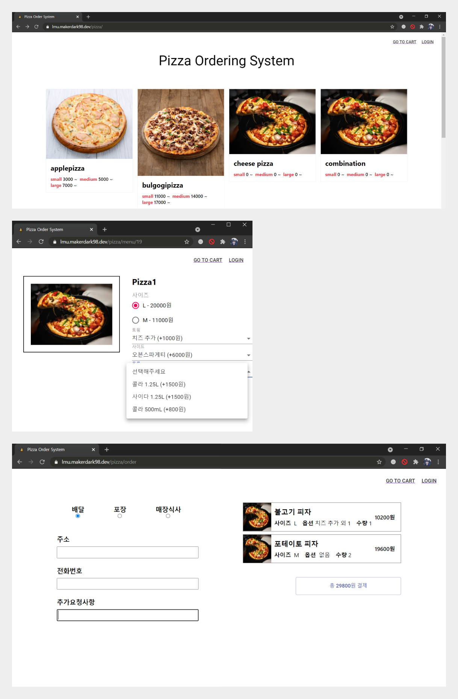
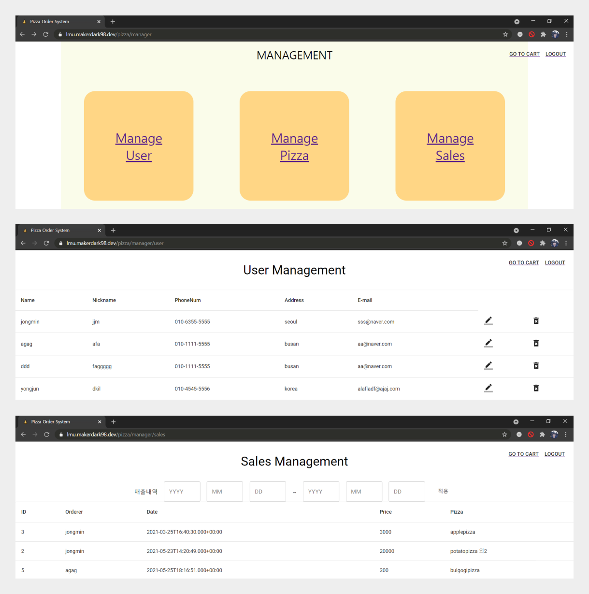
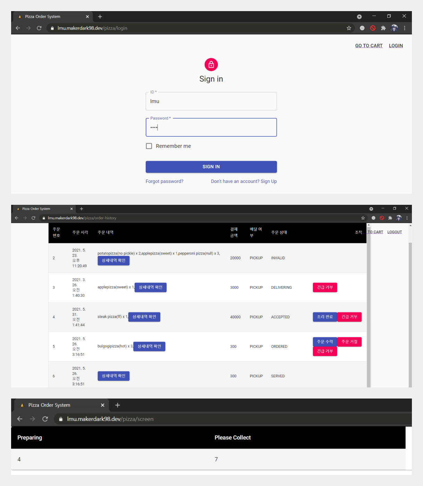

Online Pizza Ordering System For CAU-SW Engineering

[프로젝트 개요(nevonprojects)](https://nevonprojects.com/online-pizza-ordering-system/)

## 팀원 구성

| 이름   | 학번     | 학과       | 깃허브                                        |
| ------ | -------- | ---------- | --------------------------------------------- |
| 이민욱 | 20171105 | 소프트웨어 | [makerdark98](https://github.com/makerdark98) |
| 정용준 | 20173875 | 소프트웨어 | [dkile](https://github.com/dkile)             |
| 신원준 | 20170223 | 소프트웨어 | [identity16](https://github.com/identity16)   |
| 여일구 | 20172609 | 소프트웨어 | [sikutisa](https://github.com/sikutisa)       |
| 정종민 | 20174438 | 산업보안   | [alertjjm](https://github.com/alertjjm)       |
| 김준기 | 20173156 | 산업보안   | [jooomOut](https://github.com/jooomOut)       |

## Subgroups

### A. Pizza Order
피자 메뉴 선택부터 주문까지의 과정

- 담당자 : 신원준, 김준기
- 산출물 : [docs/SubgroupA_pizzaorder](https://github.com/cau-sw-engineering-2021/online-pizza-ordering-system/tree/master/docs/SubgroupA_pizzaorder)

### B. Management
통계 확인, 데이터 관리 등이 가능한 관리자용 페이지

- 담당자 : 정종민, 정용준
- 산출물 : [docs/SubgroupB_management](https://github.com/cau-sw-engineering-2021/online-pizza-ordering-system/tree/master/docs/SubgroupB_management)

### C. Order Status
들어온 주문의 준비/배달/완료 등의 상태 관리 및 디스플레이

- 담당자 : 이민욱, 여일구
- 산출물 : [docs/SubgroupC_orderstatus](https://github.com/cau-sw-engineering-2021/online-pizza-ordering-system/tree/master/docs/SubgroupC_orderstatus)


## Problem Statement

### The Problem

배달 앱들이 생겨나면서 사용자들은 편리하게 몇 번의 클릭으로 음식을 쉽게 주문할 수 있게 되었습니다. 이러한 플랫폼을 이용하면 매장 입장에서도 수월하게 사람들에게 노출이 된다는 장점이 있습니다. 그러나 배달서비스들의 수수료 정책, 프로모션 진행, UI와 환경 구성 등의 부분에서 많은 가게들이 배달서비스에 종속되는 상황이 종종 벌어지는 문제점이 있습니다.

Online Pizza Ordering System에서는 개인피자 가게에서 고객들이 보다 빠르고 편하게 주문을 할 수 있는 환경을 제공해야 합니다. 사장님들은 독립적으로 메뉴, 가격 책정, 관리를 할 수 있어 자율성을 보장 받아야 합니다. 또한, 온라인, 오프라인 모두 메뉴, 주문 과정을 통합하여 온라인(배달, 직접 수령), 오프라인에서 모두 활용 가능한 주문 현황 페이지를 제공하여 환경에 구애받지 않고 주문 시스템을 활용할 수 있어야 합니다.

### The Scenarios

웹사이트에 접속을 하면 피자와 사이드 메뉴의 목록을 확인할 수 있어야 합니다. 원하는 메뉴를 누르면 피자의 토핑, 사이즈 등의 옵션 선택이 가능해야 합니다. 사용자는 주소지, 이름 등을 입력하여 사용자 계정 생성을 생성하여 회원으로 주문할 수 있고, 비회원으로 주문할 수도 있어야 합니다. 주문 화면에서는 주문의 종류("직접수령", "배달", "오프라인 식사")를 선택하고 배달의 경우에는 배송지 정보를 입력받아야 합니다. 주문이 완료된 이후, 주문 ID가 발급되며 사용자는 이를 통해 현재 주문 상태(주문 접수, 배달중, 배달완료, 조리 완료 등)를 확인할 수 있어야 합니다.

웹사이트에 접속하여 별도로 부여된 관리자 계정 로그인을 통해 관리자용 페이지로 접속이 할 수 있어야 합니다. 관리자 페이지에는 "메뉴 관리", "매출 내역","회원 조회" 메뉴가 있어야 하고, 관리자가 "메뉴 관리"에서 피자메뉴들을 생성, 조회, 수정, 삭제 할 수 있도록 해야 합니다. "매출 내역"에서는 피자 주문량과 매출을 확인할 수 있어야 하고, "회원 조회" 메뉴에서는 사용자 목록을 확인하고 권한을 설정이 가능해야 합니다.

주문이 들어온 경우, 주문 상태는 별도의 주문 현황 페이지를 통해 관리되어야 합니다. 오프라인 전용 메뉴에서는 "주문 접수", "조리중", "수령 가능"의 세 가지로 탭을 나누어 오프라인 매장 이용 고객들이 현황을 파악할 수 있어야 합니다. 온라인 전용 메뉴에서는 사용자가 주문번호를 검색하여 "주문 접수", "조리중", "배달중", "배달 완료", "수령 가능"의 현황 확인이 가능해야 합니다. 이러한 주문 현황의 업데이트를 위한 수정 전용 메뉴를 지원해야 하고, 수정 권한을 가진 사용자만 접근할 수 있어야 합니다. 이 메뉴에서는 주문 리스트가 보여지며 주문 상태를 수정할 수 있어야 합니다.

## Checkpoint
### The 1st Checkpoint

- [Output Directory](https://github.com/cau-sw-engineering-2021/online-pizza-ordering-system/tree/master/docs/The1stCheckpointOutput)
- [Requirements](https://github.com/cau-sw-engineering-2021/online-pizza-ordering-system/blob/master/docs/The1stCheckpointOutput/Requirements.pdf)
- [Usecasemodel](https://github.com/cau-sw-engineering-2021/online-pizza-ordering-system/blob/master/docs/The1stCheckpointOutput/Usecasemodel.pdf)
- [Domainmodel](https://github.com/cau-sw-engineering-2021/online-pizza-ordering-system/blob/master/docs/The1stCheckpointOutput/Domainmodel.pdf)
- [UI Mockup](https://github.com/cau-sw-engineering-2021/online-pizza-ordering-system/blob/master/docs/The1stCheckpointOutput/UI%20mockup.pdf)

### The 2nd Checkpoint

- [Output Directory](https://github.com/cau-sw-engineering-2021/online-pizza-ordering-system/tree/master/docs/The2ndCheckpointOutput)
- [2nd Checkpoint 전체 결과 통합본 pdf](https://github.com/cau-sw-engineering-2021/online-pizza-ordering-system/blob/master/docs/The2ndCheckpointOutput/The2ndCheckpoint.pdf)
- [Object Sequence Diagram Directory](https://github.com/cau-sw-engineering-2021/online-pizza-ordering-system/tree/master/docs/The2ndCheckpointOutput/ObjectSequenceDiagram)
- [Class Diagram Directory](https://github.com/cau-sw-engineering-2021/online-pizza-ordering-system/tree/master/docs/The2ndCheckpointOutput/ClassDiagram)


## Preview
Demo project is running [here](https://lmu.makerdark98.dev/pizza)

### Subgroup A


### Subgroup B


### Subgroup C



## How To Build
* Prerequirements : JDK 11, npm 7.11.2 node 14.16.1

### For Windows
* run script
```bash
# git clone https://github.com/cau-sw-engineering-2021/online-pizza-ordering-system.git && cd online-pizza-ordering-system;
.\gradlew.bat bootRun
```

### For Linux & Mac
```bash
# git clone https://github.com/cau-sw-engineering-2021/online-pizza-ordering-system.git && cd online-pizza-ordering-system;
./gradle bootRun
```